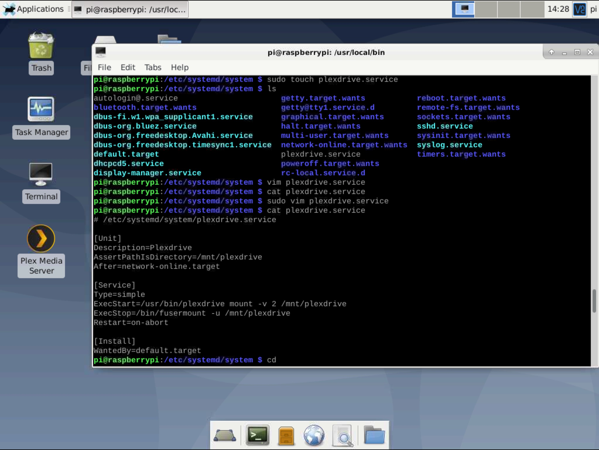
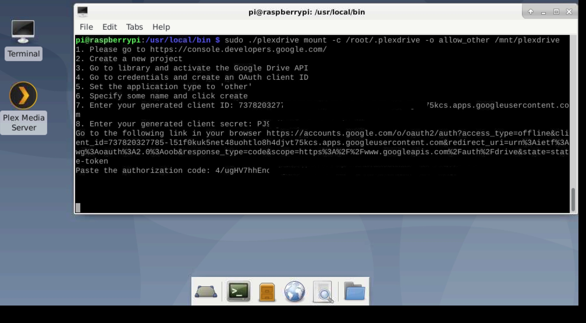
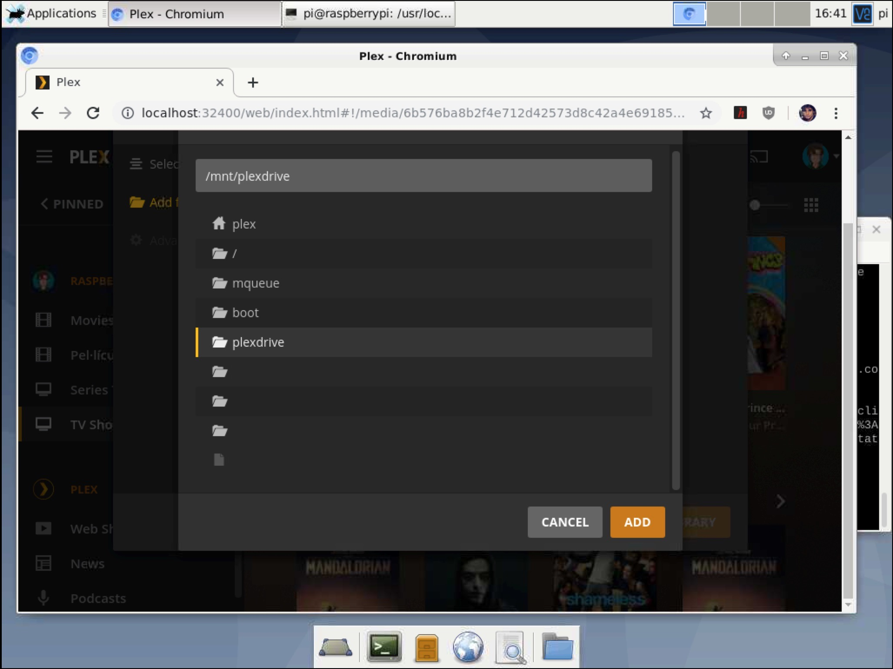

# Raspberry Pi 4 as Plex Media Server with rclone + PlexDrive. A Complete How-To guide

The following is a detailed guide on how I turned my [*Raspberry Pi 4*](https://www.raspberrypi.org/products/raspberry-pi-4-model-b/) into a [*Plex Media Server*](https://www.plex.tv) with an unlimited cloud storage Google Drive account + [*rclone*](https://github.com/rclone/rclone) + [*PlexDrive*](https://github.com/dweidenfeld/plexdrive).

Raspberry Pi 4 b           |  Plex Media Server         | PlexDrive                 | Unlimited Google Drive
:-------------------------:|:-------------------------: |:-------------------------:|:-------------------------:
   |   |  | 

## Purpose of this guide. What is Plex?
This guide lets you create your own streaming service. Your favorite movies, TV Shows, music, web shows and more, all beautifully organized and streamed from the cloud to any of your devices.

This is possible with [Plex](https://support.plex.tv/articles/200288286-what-is-plex/), a client–server media player compatible with many devices:

**Plex client support:**<br>
Your media can be streamed and played  via:

- Web streaming
	- [Plex webapp](https://app.plex.tv)
- IPhone and IPad streaming 
	- [Plex app for IOS](https://apps.apple.com/es/app/plex-movies-tv-music-more/id383457673)
- Native Desktop app with downloads and offline mode
	- [Windows Plex app](https://www.plex.tv/media-server-downloads/#plex-app)
	- [macOS Plex app](https://www.plex.tv/media-server-downloads/#plex-app)
- TV Plex apps
	-  [AndroidTV app](https://www.plex.tv/media-server-downloads/#plex-app)
	-  [AppleTV app](https://www.plex.tv/media-server-downloads/#plex-app)
	-  [Amazon FireTV app](https://www.plex.tv/media-server-downloads/#plex-app)
	-  [Play Station app](https://www.plex.tv/media-server-downloads/#plex-app)
	-  [XBoxOne app](https://www.plex.tv/media-server-downloads/#plex-app)
	-  etc.

**Plex Media Server support:**

* [Linux](https://www.plex.tv/media-server-downloads/#plex-media-server)
* [Windows](https://www.plex.tv/media-server-downloads/#plex-media-server)
* [macOS](https://www.plex.tv/media-server-downloads/#plex-media-server)
* [Free BSD](https://www.plex.tv/media-server-downloads/#plex-media-server)
* [NAS Distributions](https://www.plex.tv/media-server-downloads/#plex-media-server)
* [Docker](https://www.plex.tv/media-server-downloads/#plex-media-server)


## What you will need:

-  **Raspberry Pi model 4** with the Raspbian Linux distribution. The raspberry model used in this guide is the *Raspberry Pi 4 b - 4GB RAM* running on a 32GB SD Card. The Raspberry will be plugged in 24/7.(The electric bill is around $5-$10/year). I suggest buying a [Raspberry4 kit on amazon](https://www.amazon.com/CanaKit-Raspberry-4GB-Basic-Kit/dp/B07TYK4RL8/ref=as_li_ss_tl?ie=UTF8&th=1&linkCode=sl1&tag=dealz04a9-20&linkId=707cb7b8a0b8cb55855d836fd4b03385&language=en_US).


-   A subscription to **Google Drive**, preferrably an unlimited cloud storage account (*.edu* or *business account*). Any other [rclone](https://rclone.org) compatible cloud storage service also works.

- **Your own content** uploaded to the cloud or the means for aquiring the content that you'll want to stream. Check out this ["Best torrent sites" article](https://www.adslzone.net/reportajes/torrent-2019).


- **Patience, it pays off in the end**.


## Setting up the Raspberry Pi 4

* If you have a brand new Raspberry Pi:
	* Follow the "[Setting up your Raspberry Pi](https://projects.raspberrypi.org/en/projects/raspberry-pi-setting-up)" official guide. 

	* [Download NOOBS](https://www.raspberrypi.org/downloads/noobs/) and use it to install the Raspbian Linux distributionon. You can follow the official [NOOBS guide](https://www.raspberrypi.org/documentation/installation/noobs.md).
* Optionally customize and optimize your Raspberry Pi Raspbian OS. I personally use:

	* XFCE4 desktop environment.
	
		`$ sudo apt-get install xfce4`

		`$ sudo update-alternatives --config x-session-manager`

	* Remote desktop control with [VNC Viewer/Server](https://www.realvnc.com/en/) in order to use the Raspberry Pi GUI Interface remotely and avoid the need for a PC screen, a keyboard and a mouse for the Raspberry.
	
		```bash
		$ sudo apt-get update
		$ sudo apt-get install real-vnc-server
		$ sudo apt-get install real-vnc-viewer
		$ sudo raspi-config #turn on vnc remote access
		```

***Note**: We use Raspbian because it is the official and most supported, stable and hardware-compatible distro for the Raspberry. It is also very lightweight.


## Install Plex Media server
1. Now before we install the Plex Media Server software to the Raspberry Pi, we first need to ensure our operating system is up to date by running the following two commands.

   ```bash
   $ sudo apt-get update
   $ sudo apt-get upgrade
   ```
	
2. To install the Plex packages to the Raspberry Pi, we will need to add the official Plex package repository. Before we do that we need to install the “apt-transport-https” package, this package allows the “apt” package manager to retrieve packages over the “https” protocol that the Plex repository uses.

   ```bash 
   $ sudo apt-get install apt-transport-https
   ```

3. Let’s now add the Plex repositories to the “apt” package managers key list. This key is used to ensure the files that you are downloading are in fact from that repository and signed by that key.

   ```bash
   $ curl https://downloads.plex.tv/plex-keys/PlexSign.key | sudo apt-key add -
   ```

4. With the Plex GPG key now added, we can finally add the official plex repository to the sources list by running the following command.

   ```bash
   $ echo deb https://downloads.plex.tv/repo/deb public main | sudo tee /etc/apt/sources.list.d/plexmediaserver.list
   ```

5. As we have just added a new repository to our sources, we will need to run the “update” command again to refresh the package list.

   ```bash
   $ sudo apt-get update
   ```

6. Now that we have set up our Raspberry Pi so that it can read from Plex’s official package repositories we can go ahead and finally install the Plex Media server package to the Pi. To install the “plexmediaserver” package, go ahead and run the command below.

   ```bash
   $ sudo apt-get install plexmediaserver
   ```

7. By default, the Plex Media Server package will utilize a user named “plex“. To reduce the chances of dealing with annoying permission issues, we will change the server’s default file so that it utilizes the “pi” user instead.

   ```bash
   $ sudo nano /etc/default/plexmediaserver
   ```

8. Within this file change the PLEX_MEDIA_SERVER_USER line from plex to pi as we have shown in our example below. Find:

   > export PLEX_MEDIA_SERVER_USER=plex

   And replace with:

   > export PLEX_MEDIA_SERVER_USER=pi

   Once done, save and exit the file by pressing Ctrl + X then pressing Y and pressing ENTER.

9. As we have made changes to the “default” file, we will need to restart the “plexmediaserver” service. Restarting the service ensures that it loads in our changes and starts using the “pi” user.

   ```bash
   $ sudo systemctl restart plexmediaserver
   ```

10. Now the Plex Media Server app appears on the *Menu->Multimedia*. I suggest creating a desktop shortcut.


### 4. Install rclone.

To install rclone on Linux/macOS/BSD systems with a script installation, run:

```bash
$ curl https://rclone.org/install.sh | sudo bash
```

### 5. Create your own Google Drive API OAuth *client_id* and *secret*.

To obtain this credentials, follow the steps [here](https://rclone.org/drive/#making-your-own-client-id).

### 6. Install Plexdrive. See [PlexDrive on Github](https://github.com/dweidenfeld/plexdrive).

With Rclone it is possible to mount your drive as a local filesystem. Yet, Plexdrive is a necessary alternative because it is engineered to use cache so that Plex Media Server file requests do not exceed the Google Drive API limit. Otherwise, you could get a 24h ban and you wouldn't be able use your google drive account for an entire day (this happened to me repeatedly).

1. To install PlexDrive, first you need to install its dependencies, i.e to have *FUSE (Filesystem in Userspace)* installed.

	```bash
	$ sudo apt-get install fuse
	```
	
2. Now we will create a systemd startup script for automatic startup on boot.

  ```bash
  $ cd /etc/systemd/system/
  $ sudo touch plexdrive.service
  $ sudo nano plexdrive.service
  ```

  Within the nano editor, paste this:

 ```
 # /etc/systemd/system/plexdrive.service

 [Unit]
 Description=Plexdrive
 AssertPathIsDirectory=/mnt/plexdrive
 After=network-online.target
 
 [Service]
 Type=simple
 ExecStart=/usr/bin/plexdrive mount -v 2 /mnt/plexdrive
 ExecStop=/bin/fusermount -u /mnt/plexdrive
 Restart=on-abort
 
 [Install]
 WantedBy=default.target
 ```

Once done, save and exit the file by pressing Ctrl + X then pressing Y and pressing ENTER.

3. Check that the file was created correctly by printing its content to standard output

	```bash
	$ cat plexdrive.service
	```
	
	At this point, the Pi desktop looks like this:
	
	
4. Download the latest plexdrive-linux-arm7 build from the plexdrive [releases page](https://github.com/dweidenfeld/plexdrive/releases/tag/5.0.0):

  ```bash
  $ wget https://github.com/dweidenfeld/plexdrive/releases/download/5.0.0/plexdrive-linux-arm7
  ```

5. Move the downloaded file to the user's bin folder and change directory to it

  ```bash
  $ sudo mv plexdrive-linux-arm7 /usr/local/bin/plexdrive
  $ cd /usr/local/bin
  ```

  Change ownership and execution rights of the downloaded plexdrive file

  ```bash
  $ sudo chown root:root /usr/local/bin/plexdrive
  $ sudo chmod 755 /usr/local/bin/plexdrive
  ```

6. Create root directory and run plexdrive to mount the plexdrive virtual file system volume.

  ```bash
  $ mkdir /mnt/plexdrive/
  $ sudo ./plexdrive mount -c /root/.plexdrive -o allow_other /mnt/plexdrive/
  ```

  You will be promted to enter your google drive API remote *client_id* and *secret* and to follow a link to get your google authorization code. The dialog looks like this:
  
  Congratulations, you have succesfully configured a virtual filesystem

### 7. Configure your Plex Media Server libraries to read from the plexdrive directory

1. Start Plex Media server
2. Login to your Plex account
3. Add a library to your server
3. Specify the library path of your plexdrive volume`/mnt/plexdrive/mydrivmediafiles`.


Congratulations! Plex will analyze, organize and load metadata for all the media files on your drive and serve them for streaming on demand to any of your devices! 🎉🎉

### 8. Plex Server Software updates
When Plex releases a new version of their software, how to update you Plex Media Server to the latest version?

When there is a new software update available, Plex will notify you in the main page of the online service. To upgrade, do the following:

1. Access your Raspberry Pi Remotely.
2. Open Plex Server from the Rasberry browser.
2. Click on the available software update promt.
3. Plex will download the new application installation package: `plexmediaserver_1.18.7.2457-77cb9455c_armhf.deb`
4. Run the installation with the command:
```bash
$ sudo apt install /home/pi/Downloads/plexmediaserver_1.18.7.2457-77cb9455c_armhf.deb
```
5. Finally, restart the Plex Media Server with the command:
```bash
$ sudo systemctl restart plexmediaserver
```


### 9.Comments & issues

If your raspberry pi is rebooted or suffers any probelm, just run plexdrive and Plex Media Server again.

```bash
$ /usr/local/bin/plexdrive mount /mnt/plexdrive/
$ sudo service plexmediaserver start
```
### Command cheat sheet

```
sudo apt-get update
sudo apt-get upgrade
sudo service plexmediaserver stop
sudo service plexmediaserver start
sudo service plexmediaserver restart
sudo reboot (Reboots Pi)
sudo tuptime (Shows Pi uptime)
sudo shutdown -h now (Shutdown now)
sudo apt-get install stfs-3g (for storage systems over 2 gigs)
sudo apt-get install plexmediaserver-install (Update Plex)
iwconfig (Wifi Strength)
```

### Links & Refs

Some references, tutorials and learning material I have used:


1. Install Plex Media server part. [How to Setup a Raspberry Pi Plex Server](https://pimylifeup.com/raspberry-pi-plex-server/). 

2. [Plexdrive installation](https://github.com/dweidenfeld/plexdrive/blob/master/TUTORIAL.md) and tutorial. 

1. [hoarding.me](https://hoarding.me)

2. [Using Raspberry Pi 3+ as Plex Media Server (raspberrypi.org)](https://www.raspberrypi.org/forums/viewtopic.php?t=214655)

3. [Plex Media Server On Raspberry Pi 4](https://tynick.com/blog/09-22-2019/plex-media-server-on-raspberry-pi-4/)


